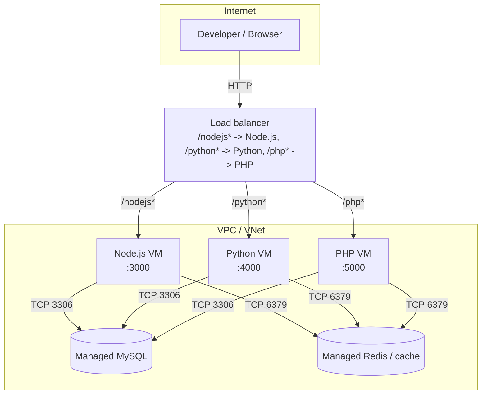

# OpenTofu multi-cloud starter

A minimal, learn-by-reading [OpenTofu](https://opentofu.org/) starter that
provisions the same shape of stack — three VM-based app tiers (**Node.js**,
**Python**, **PHP**) backed by a managed **MySQL** database and a managed
**Redis**-compatible cache — on four different providers:

- [DigitalOcean](./digitalocean/) — Droplets + Managed Databases (MySQL & Valkey)
- [AWS](./aws/) — EC2 + RDS (MySQL) + ElastiCache (Redis)
- [GCP](./gcp/) — Compute Engine + Cloud SQL (MySQL) + Memorystore (Redis)
- [Azure](./azure/) — Virtual Machines + Azure Database for MySQL + Azure Cache for Redis

Each provider folder is a **fully independent, standalone OpenTofu root
module** — pick the one you want, `cd` into it, and apply. They are not
meant to be applied together; this is a "same architecture, one provider at
a time" starter, not a simultaneous multi-cloud deployment.

## High-level architecture

The same logical shape is repeated in every provider folder; only the
provider-native resource names differ (see each provider's own `README.md`
for its "What gets created" list, and the comments in its `.tf` files for
exact resources).



A load balancer routes you to one of three small servers - Node.js,
Python, or PHP - based on the URL path (`/nodejs`, `/python`, `/php` - all
three follow the same pattern, no special-cased default). All three read
from the same shared MySQL database and Redis cache. SSH access to the VMs
is separate from the load balancer and restricted to your own IP.

## Why plain VMs?

Every provider tier runs the same architecture pattern: a VPC/VNet, one VM
per language runtime, a load balancer in front of them, a managed MySQL
instance, and a managed Redis/cache instance, wired together with
firewall/security-group rules. VMs (rather than containers or Kubernetes)
were chosen so the OpenTofu code stays close to first principles —
networking, compute, load balancing, and managed data services — with
nothing hidden behind a platform-specific PaaS or an orchestrator.

## Load balancing

Every provider now fronts the three app VMs with a single load balancer
that **path-routes** to each app: `/nodejs*` → Node.js, `/python*` →
Python, `/php*` → PHP - all three apps are reached the same symmetric way.
This is implemented with each cloud's native L7 load
balancer (AWS Application Load Balancer, GCP external HTTP(S) load
balancer, Azure Application Gateway) — **except DigitalOcean**, whose
Load Balancer product doesn't support path-based routing; that folder adds
a small nginx reverse-proxy VM behind DigitalOcean's Load Balancer to get
the same single-entry-point behavior. See each provider's README for its
exact load-balancer resources and diagram.

## Environment variables

Every app VM gets its configuration (port, MySQL/Redis endpoint, and
anything you add) via environment variables, not baked-in template values —
see [`apps/README.md`](./apps/README.md#environment-variables) for how the
mechanism works. To pass your own custom environment variables to an app,
set the corresponding `node_env` / `python_env` / `php_env` variable
(`map(string)`) in that provider's `terraform.tfvars`:

```hcl
node_env = {
  LOG_LEVEL = "debug"
}
```

## Repository layout

```
.
├── apps/               # Shared, dependency-free app source embedded via cloud-init
│   ├── node/            # Node.js status app (port 3000)
│   ├── python/          # Python status app  (port 4000)
│   └── php/             # PHP status app     (port 5000)
├── digitalocean/        # Standalone OpenTofu root module for DigitalOcean
├── aws/                 # Standalone OpenTofu root module for AWS
├── gcp/                 # Standalone OpenTofu root module for GCP
└── azure/               # Standalone OpenTofu root module for Azure
```

Each provider folder contains:

| File                        | Purpose                                             |
|-----------------------------|------------------------------------------------------|
| `README.md`                 | Provider-specific prerequisites, quickstart & cost   |
| `versions.tf`                | Required OpenTofu & provider versions               |
| `providers.tf`               | Provider configuration (region, auth)               |
| `variables.tf`               | Input variables                                     |
| `network.tf`                 | VPC/VNet, subnets, firewall/security groups         |
| `compute.tf`                 | The three app VMs                                   |
| `loadbalancer.tf`             | The load balancer / path-routing setup             |
| `database.tf`                | Managed MySQL                                       |
| `redis.tf`                   | Managed Redis / cache                               |
| `outputs.tf`                 | Load balancer URL, DB/Redis endpoints               |
| `terraform.tfvars.example`   | Copy to `terraform.tfvars` and fill in              |

## What each app does

Every VM is provisioned via cloud-init to install its language runtime and
run a tiny, **stdlib-only** HTTP service (no build step, no package install
at boot) that reports whether it can reach MySQL and Redis over TCP. It's a
connectivity smoke test that proves the infrastructure is wired correctly —
see [`apps/README.md`](./apps/README.md) for details and sample output.

## Prerequisites

- [OpenTofu](https://opentofu.org/docs/intro/install/) >= 1.6
- An account, and credentials configured locally, for whichever provider you pick:
  - DigitalOcean: `doctl auth init` or a Personal Access Token
  - AWS: `aws configure` or standard `AWS_ACCESS_KEY_ID`/`AWS_SECRET_ACCESS_KEY` env vars
  - GCP: `gcloud auth application-default login` and a project ID
  - Azure: `az login`
- An SSH key pair to reach the VMs (`ssh-keygen -t ed25519` if you don't have one)

## Quickstart (any provider)

```bash
cd <provider>                       # digitalocean | aws | gcp | azure
cp terraform.tfvars.example terraform.tfvars
$EDITOR terraform.tfvars            # fill in region, ssh key, DB password, etc.

tofu init
tofu plan
tofu apply
```

When it finishes, `tofu output` prints the load balancer URL (with the
path for each app) plus the MySQL/Redis endpoints.

To tear everything down:

```bash
tofu destroy
```

## Notes & production caveats

This is a **starter**, optimized for readability over hardening:

- No secrets are baked into VM user-data — the apps only perform TCP
  reachability checks, so no DB credentials need to leave the managed
  service. Wire in a secrets manager before adding real queries.
- SSH and the app ports are restricted via a variable (`allowed_ssh_cidr` /
  similar) that defaults to a placeholder — **set it to your own IP** before
  applying.
- Each provider uses a different network-isolation model for the database
  and cache (some use private networking, some use IP allowlisting on a
  public endpoint) — see the comments in that provider's `database.tf` /
  `redis.tf` before treating this as a production baseline.
- The load balancer is **HTTP only** (no TLS) — there's no domain name
  assumed. Add a certificate (ACM, Google-managed cert, Key Vault/Let's
  Encrypt, Let's Encrypt on the DO edge VM) once you have a domain to
  point at it.
- Each app VM is still a single instance behind the load balancer — the LB
  gives you a stable entry point, path routing, and health checks, not
  high availability. Scale an app tier to multiple instances if you need
  real redundancy.
